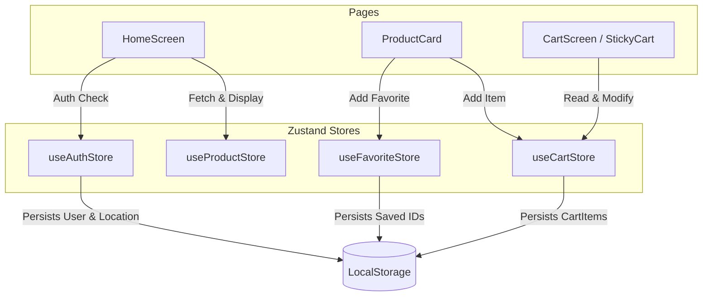

# 🏛️ Architecture Documentation — Ahoum Grocery

This document outlines the core architectural patterns, design patterns, and engineering choices implemented in the **Ahoum** codebase.

---

## 1. Responsive Layout Strategy (Layered Breakpoints)

Ahoum is engineered with a **Mobile-First Core Layout** layered with custom desktop layouts using Tailwind CSS breakpoint states.

### Modular Breakpoint Rendering
- **Mobile Interfaces**: Elements tailored for handheld interactions (like `BottomNav`, floating action buttons, swipeable sliders, and overlay cards) use base styles (e.g., `flex`, `block`) and are hidden on desktop screens using `lg:hidden`.
- **Desktop Dashboard**: Larger screens (laptops, monitors) activate grid structures and persistent sidebars using the `lg:` breakpoint prefix (e.g. `hidden lg:block lg:flex`).
- **Layout Flow Structure**:
  ```text
  ┌────────────────────────────────────────────────────────┐
  │                    DesktopHeader                       │
  ├────────────────────────────────────────────────────────┤
  │ ┌──────────────┐ ┌───────────────────┐ ┌─────────────┐ │
  │ │              │ │   Hero Banner     │ │             │ │
  │ │  Category    │ ├───────────────────┤ │ Persistent  │ │
  │ │  Sidebar     │ │   Product Grid    │ │ StickyCart  │ │
  │ │  Navigation  │ │   - Offers        │ │ Panel       │ │
  │ │              │ │   - Best Sellers  │ │             │ │
  │ └──────────────┘ └───────────────────┘ └─────────────┘ │
  └────────────────────────────────────────────────────────┘
  ```

---

## 2. State Architecture (Zustand Stores)

State management is localized into clean stores under `src/store/` with isolated responsibilities:



### Store Schemas

#### A. Authentication Store (`useAuthStore`)
- **State**: User credentials (`User | null`), selected location coordinates (`LocationOption | null`), and onboarding state flag (`onboardingComplete`).
- **Actions**:
  - `login()`: Simulates authentication latency.
  - `sendOtp()` & `verifyOtp()`: Validates SMS triggers.
  - `setLocation()`: Controls delivery routing zones (Zone/Area selections).
- **Persistence**: Persists the credentials using the `nectar-auth` local storage namespace.

#### B. Cart Store (`useCartStore`)
- **State**: Arrays of `CartItem` (holding products and quantities).
- **Actions**:
  - `addItem()` / `removeItem()` / `updateQuantity()`: Synchronous CRUD updates.
  - `placeOrder()`: Simulates asynchronous payment gateways with an **85% success rate** and **15% failure rate** simulation.
- **Persistence**: Automatically persists shopping state under the `nectar-cart` namespace.

#### C. Product Catalog Store (`useProductStore`)
- **State**: Master products catalog, query search bars, selected category filters, and detailed sorting settings (`price_low`, `price_high`, `rating`, `popularity`).
- **Filtering Pipeline**:
  Whenever filters or query strings are altered, the store automatically runs a local filtering pipeline over the database:
  $$\text{Source Catalog} \xrightarrow{\text{Category Filter}} \text{Filtered Subset 1} \xrightarrow{\text{Search Query}} \text{Filtered Subset 2} \xrightarrow{\text{Price/Organic Filters}} \text{Result}$$

---

## 3. UI Animation Orchestration

Animations are configured using **GSAP (GreenSock Animation Platform)** combined with native CSS transitions.

### Scroll Reveal Animations (`HomeScreen.tsx`)
We use GSAP's `ScrollTrigger.batch` on catalog view mounts to trigger staggered card load-ins:
```typescript
ScrollTrigger.batch(".product-card-anim", {
  scroller: scrollContainerRef.current,
  start: "top 92%",
  once: true,
  onEnter: (batch) =>
    gsap.from(batch, {
      opacity: 0,
      y: 24,
      duration: 0.5,
      stagger: 0.08,
      ease: "power3.out",
      overwrite: true,
    }),
});
```
This lifts the product grid elements smoothly into view as the user scrolls, minimizing layout shifts and delivering a fluid experience.

### Micro-Transitions
- **Interactive Scaling**: Buttons scale down slightly (`active:scale-95`) and hover cards lift up (`hover:-translate-y-1`) for direct physical feedback.
- **Overlay Sheets**: Authentication modules and side navigation panels slide upward with custom cubic bezier keyframes (`cubic-bezier(0.16, 1, 0.3, 1)`).

---

## 4. Simulated API & Network Layer

To maintain architectural isolation, all data operations mimic server communications:
- **Product Loading**: The catalog loads mock dataset with a simulated latency of `800ms`.
- **Checkout Gateway**: Order placement triggers a `2000ms` asynchronous timer, allowing the client to display state indicators (spinning icons/loading bars) before loading the Order Success or Order Failed outcomes.
